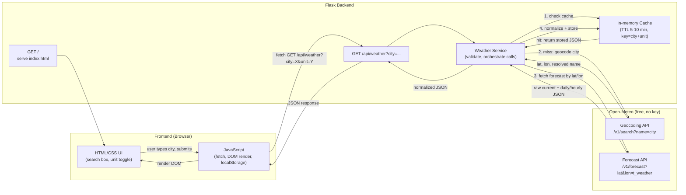

# Plan: Weather Dashboard with Open-Meteo

Building an HTML/CSS/JS frontend + Flask backend weather dashboard using Open-Meteo (free, no API key required).

## Requirements

### Functional Requirements

#### 1. Location Input
- FR1.1: User can search for a city/location by name (text input).
- FR1.2: User can optionally use browser geolocation to auto-detect current location.
- FR1.3: App validates input and shows an error/message if the location is invalid or not found.

#### 2. Weather Data Retrieval
- FR2.1: Flask backend exposes an API endpoint (`/api/weather?city=...`) that geocodes the city then fetches weather data from Open-Meteo.
- FR2.2: Backend returns current conditions: temperature, humidity, wind speed, weather description, icon/condition code.
- FR2.3: Backend returns forecast data (daily min/max, weather code).
- FR2.4: Backend requires no API key (Open-Meteo is keyless).

#### 3. Display / UI
- FR3.1: Frontend renders current weather (temperature, condition, icon, humidity, wind).
- FR3.2: Frontend renders a forecast section (list/cards for upcoming days).
- FR3.3: Unit toggle (Celsius/Fahrenheit).
- FR3.4: Loading indicator while fetching data.
- FR3.5: Error message display on failed requests (invalid city, network failure).

#### 4. Search History / Favorites (optional)
- FR4.1: Store recently searched cities (localStorage).
- FR4.2: Allow marking/saving favorite locations for quick access.

#### 5. Backend API
- FR5.1: `GET /` — serves the main HTML page.
- FR5.2: `GET /api/weather` — returns JSON weather data for a given query.
- FR5.3: Input validation and sanitization on all query parameters.
- FR5.4: Proper HTTP status codes (200, 400, 404, 502) and JSON error bodies.

#### 6. Theming (optional)
- FR6.1: UI changes (background/theme) based on weather condition (sunny, rainy, night, etc.).

### Non-Functional Requirements

#### 1. Performance
- NFR1.1: API responses returned within an acceptable time (e.g., < 2s under normal network conditions).
- NFR1.2: Backend caches recent weather queries briefly (5–10 min TTL, keyed by city+unit) to reduce external calls.

#### 2. Security
- NFR2.1: No API key exposed to frontend (moot for Open-Meteo, but keep pattern for future providers).
- NFR2.2: Input sanitization on backend to prevent injection attacks (query params, headers).
- NFR2.3: HTTPS enforced in production.
- NFR2.4: CORS configured restrictively (only allow required origins).
- NFR2.5: Rate limiting on the Flask API to prevent abuse.
- NFR2.6: No sensitive data logged.

#### 3. Reliability / Availability
- NFR3.1: Graceful degradation/error handling if Open-Meteo is down or slow.
- NFR3.2: Retry logic or fallback message for transient failures.

#### 4. Usability
- NFR4.1: Responsive design — works on mobile, tablet, desktop.
- NFR4.2: Accessible UI (semantic HTML, ARIA labels, sufficient color contrast, keyboard navigation).
- NFR4.3: Clear, simple UI with minimal clicks to get weather info.

#### 5. Maintainability
- NFR5.1: Clear separation of concerns (Flask routes/services, static HTML/CSS/JS assets).
- NFR5.2: Configuration (cache TTL, defaults) externalized via config file/env vars.
- NFR5.3: Code organized for easy addition of new features (e.g., new data providers, forecast types).

#### 6. Scalability
- NFR6.1: Backend stateless (or externally-stored cache) to allow horizontal scaling.
- NFR6.2: Caching layer (in-memory or Redis) to handle increased request volume.

#### 7. Compatibility
- NFR7.1: Works across major modern browsers (Chrome, Firefox, Edge, Safari).
- NFR7.2: Backend compatible with common deployment targets (Gunicorn/WSGI, Docker).

#### 8. Portability
- NFR8.1: Easily deployable via Docker or standard Python/Flask hosting.

## User Stories

**US1: Search Weather by City**
As a user, I want to search for a city's current weather so that I can quickly check conditions before heading out.
- Acceptance Criteria: Given a valid city name, when I search, then I see temperature, condition, humidity, and wind speed for that city.

**US2: View Weather Forecast**
As a user, I want to see a multi-day forecast so that I can plan my activities in advance.
- Acceptance Criteria: Given a searched city, when the forecast loads, then I see a list/cards of upcoming days with temperature and condition icons.

**US3: Handle Errors Gracefully**
As a user, I want to see a clear error message when my search fails (invalid city or network issue) so that I understand what went wrong and can retry.
- Acceptance Criteria: Given an invalid city name or a failed API call, when I submit a search, then I see a friendly error message instead of a blank/broken page.

**US4: Toggle Temperature Units**
As a user, I want to switch between Celsius and Fahrenheit so that I can view weather in my preferred unit.
- Acceptance Criteria: Given weather data is displayed, when I toggle the unit switch, then all temperature values update immediately to the selected unit.

## Architecture Diagram



## Data Flow (Step-by-Step)
1. **Page load**: Browser requests `/`, Flask serves `index.html` + static assets.
2. **User input**: User types a city name (or uses geolocation to get lat/lon directly, bypassing geocoding).
3. **Frontend request**: JS calls `GET /api/weather?city=<name>&unit=<c|f>`.
4. **Backend validation**: Flask validates `city` param (non-empty, reasonable length) → `400` on failure.
5. **Cache check**: Keyed by normalized `city+unit`. Cache hit → skip to step 8.
6. **Geocoding step**: On cache miss, backend calls `https://geocoding-api.open-meteo.com/v1/search?name=<city>&count=1` to resolve city name → `{latitude, longitude, name, country}`. If no results, return `404` ("city not found").
7. **Forecast step**: Backend calls `https://api.open-meteo.com/v1/forecast?latitude=<lat>&longitude=<lon>&current_weather=true&daily=temperature_2m_max,temperature_2m_min,weathercode&timezone=auto` to get current conditions + daily forecast.
8. **Response shaping**: Backend maps Open-Meteo's `weathercode` (WMO codes) to human-readable conditions/icons, converts units if needed, and normalizes into internal JSON shape (temp, condition text, wind, humidity if using extra params, forecast array).
9. **Cache store**: Store normalized result with TTL.
10. **Response to frontend**: Flask returns JSON (`200` success, `404` city not found, `502` if Open-Meteo unreachable).
11. **Frontend render**: JS updates DOM with current weather + forecast cards; shows error message on failure.
12. **Optional**: JS stores searched city in `localStorage` for recent/favorites list.

## Project Structure

```
kpiaugapp/
├── app.py                      # Flask app factory, route registration
├── config.py                   # Config class (cache TTL, host/port, debug flag)
├── requirements.txt            # flask, requests, python-dotenv
├── .env.example                # placeholder for future config (no keys needed for Open-Meteo)
├── .gitignore
│
├── services/
│   ├── __init__.py
│   ├── geocode_service.py      # calls Open-Meteo geocoding API, returns lat/lon
│   ├── weather_service.py      # calls Open-Meteo forecast API, normalizes response
│   ├── weather_codes.py        # WMO weathercode -> {description, icon} lookup dict
│   └── cache.py                # simple TTL in-memory cache (city+unit key)
│
├── routes/
│   ├── __init__.py
│   └── weather_routes.py       # Blueprint: GET /api/weather
│
├── static/
│   ├── css/
│   │   └── style.css           # layout, responsive rules, condition-based theming
│   ├── js/
│   │   └── app.js              # fetch calls, DOM rendering, unit toggle, localStorage
│   └── img/                    # weather icons (if not using emoji/icon font)
│
├── templates/
│   └── index.html              # main page (search box, current weather, forecast cards)
│
└── tests/
    ├── test_geocode_service.py
    ├── test_weather_service.py
    └── test_routes.py
```

## Decisions
- No API key/config needed — simplifies NFR2.1 (no secret management) since Open-Meteo is keyless.
- Two external calls per uncached request (geocode + forecast); cache mitigates repeated latency/calls.
- WMO weather code mapping table needed in backend (Open-Meteo returns integer codes, not text descriptions) — must be maintained as static lookup.
- Geolocation-based searches (lat/lon from browser) can skip the geocoding step entirely and call forecast directly.
- `services/` separates external API integration (geocoding, forecast, caching, code-mapping) from Flask routing.
- `routes/weather_routes.py` as a Blueprint rather than defining routes in `app.py` directly.

## Verification
1. Manually test `/api/weather?city=London` returns normalized JSON with current + forecast.
2. Test invalid city (e.g., `city=asdkjaskjd`) returns `404` with friendly error.
3. Test cache: second identical request within TTL should not trigger new Open-Meteo calls (verify via logging/timing).
4. Test unit toggle produces correctly converted values (°C ↔ °F).

## Further Considerations
1. Which Open-Meteo params to include (humidity, wind, precipitation)? Recommend starting with `current_weather=true` + `daily=temperature_2m_max,temperature_2m_min,weathercode,precipitation_sum` for a solid MVP forecast card set.
2. WMO code mapping — build once as a small static dict/JSON in the backend rather than depending on any external icon library.
3. Cache backend choice: in-memory dict (simple, single-process) vs Redis (scales across workers). Recommend starting with in-memory for MVP.
4. Should forecast data be a separate endpoint (`/api/forecast`) or bundled into `/api/weather`? Recommend bundling for MVP to reduce round trips.
